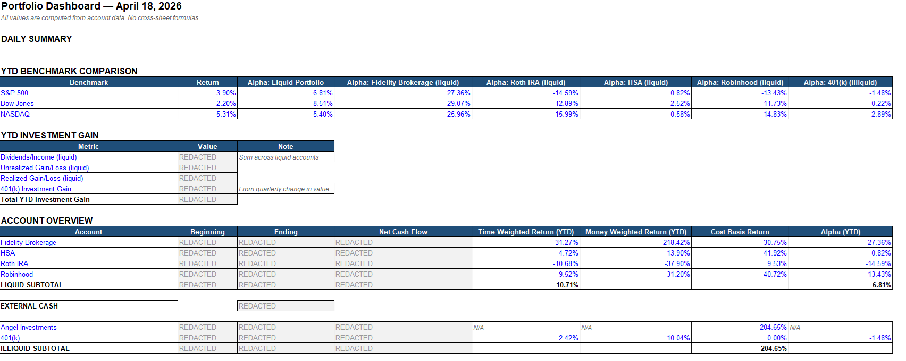
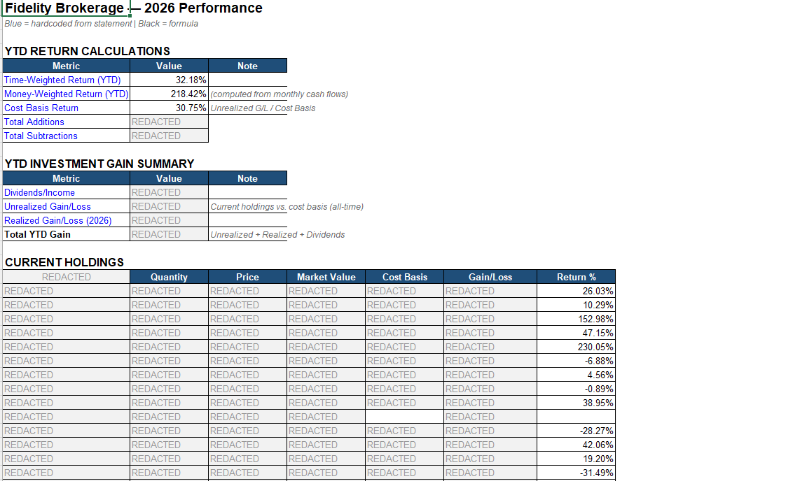
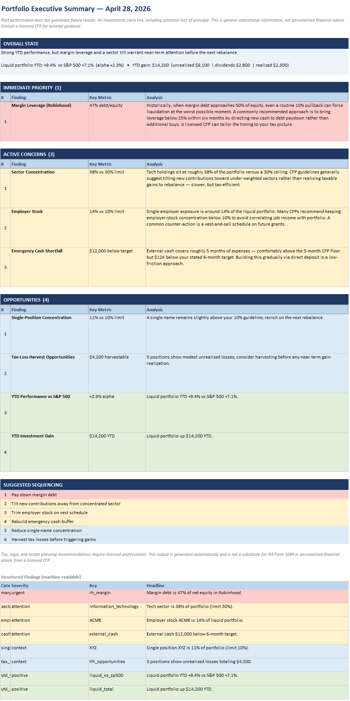

# Agent Plutus

**See all your investments in one place.** The agent automatically pulls your latest balances from Fidelity, Robinhood, your 401(k), and other accounts — then builds a single Excel report showing how your money is doing daily, plus a one-page advisor brief that interprets it in plain English.

**Privacy first:** Your raw financial data — holdings, account numbers, balances, credentials — never leaves your machine. The optional advisor brief sends a *summary* of findings (severities, percentages, headlines) to Anthropic's API to compose the narrative; without an API key, it falls back to a deterministic local-only brief. See [Your Advisor Brief](#your-advisor-brief) for details.

## What It Does

If you have investments spread across multiple apps, you probably have no idea how your total portfolio is actually performing. Each app shows you a piece, but none shows the whole picture. This tool fixes that.

1. **Connects to your accounts** — securely pulls your latest balances and holdings from each brokerage, similar to how Mint or Empower (Personal Capital) works
2. **Compares you to the market** — grabs S&P 500, Dow Jones, and NASDAQ performance so you can see if you're ahead or behind
3. **Builds your daily report** — creates one Excel file with everything organized by account
4. **Tracks changes over time** — saves daily snapshots so you can see how your portfolio moved day to day
5. **Writes you a one-page advisor brief** — runs your portfolio through ~15 standard CFP-style health checks (concentration risk, glide path, cash buffer, tax-loss opportunities, etc.) and asks Claude to turn the results into calm, plain-English narrative — not "buy this stock," more "your margin debt is 47% of equity; here's what that means and a commonly recommended response"

## What You'll See

Your report is an Excel workbook with these pages:

- **Dashboard** — your total net worth across all accounts, whether you're beating the market, and where your money is concentrated
- **Account pages** (Fidelity Brokerage, Roth IRA, HSA, Robinhood, 401k) — what you own in each account, what you paid for it, and your profit or loss
- **Angel Investments** — if you have any private company investments, they're tracked here with automatic valuation lookups
- **Cash** — liquid balances across checking, savings, and brokerage cash positions
- **Recommendations** — a one-page advisor brief interpreting your portfolio's health (see [Your Advisor Brief](#your-advisor-brief))

### Sample Report

**Dashboard** — benchmark comparison, YTD gains, account overview, and sector concentration at a glance. Dollar amounts are redacted; returns and percentages are real.



**Account tab** — each brokerage account gets its own page with return metrics, gain/loss summary, and current holdings.



**Recommendations tab** — the advisor brief, grouped into Immediate Priority, Active Concerns, and Opportunities, with severity-coded rows and per-finding narrative. Synthetic example below (no real holdings shown).



## Your Advisor Brief

Every workbook also includes a **Recommendations** tab — a one-page executive summary of your portfolio's health, written in plain English by Claude (Anthropic's LLM).

### What it analyzes

The advisor runs 15 standard portfolio checks — the kind a Certified Financial Planner walks through with a client during an annual review:

| Topic | What it flags |
|---|---|
| **Concentration risk** | Single position over your limit, sector overweight, employer stock cluster |
| **Cash & emergency fund** | Cash below 3-month expenses, upcoming expense not yet covered |
| **Leverage** | Margin debt as % of equity, interest-cost estimate |
| **Asset allocation** | Glide path drift, international equity underweight, inflation hedge exposure |
| **Tax efficiency** | Asset location inefficiency, tax-loss harvest candidates |
| **Performance** | YTD vs S&P 500, alpha, gain breakdown (unrealized / dividends / realized) |
| **Lifecycle** | Pre-retirement equity risk relative to time horizon |

Each finding gets a severity — 🔴 urgent / ⚠ attention / ℹ context / ✅ positive — and lands in the Recommendations tab grouped by priority, with a one-line interpretation and (where applicable) a suggested action. Lifecycle-aware checks (glide path, retirement risk, employer stock, emergency fund) only fire if your profile is configured; without one, you still get the rest.

### What it sounds like

Tone is calm and educational, never prescriptive. The narrator uses CFP-style framing:

> *"Historically, when margin debt approaches 50% of equity, even a routine 10% pullback can force liquidation at the worst possible moment. A commonly recommended approach for someone in your situation is to bring leverage below 25% within six months. A licensed CFP can tailor this to your specific tax picture."*

The advisor respects **hard rules** from your profile (e.g. *"never recommend selling NVDA — conviction hold"*) and **never claims to be a licensed advisor**. Every brief carries the standard disclosures around past performance, principal risk, and the limits of educational content.

### Day-over-day diff

The advisor remembers what it told you yesterday. New findings get a fresh narrative; standing concerns get a one-liner reminder rather than the full re-explanation every morning.

### How to set up your profile

The advisor reads `user_profile.json` (gitignored — stays local). To create yours:

1. Copy the template:
   ```bash
   cp user_profile.example.json user_profile.json
   ```
2. Edit `user_profile.json` in any text editor — it's plain JSON.
3. Save. The next pipeline run picks it up automatically — no restart needed.

The annotated template shows every field, what each one does, and which observation it powers (age → glide path; retirement year → lifecycle risk; employer ticker → employer stock check; etc.). All fields are optional. If the file is missing or malformed, the advisor logs a warning and runs with defaults rather than failing — so you can iterate on it without breaking your daily run.

> **What if I skip the profile?** The advisor still runs and produces a brief — but ~5 of the 15 checks get silently skipped because they need profile data (glide path needs your age, emergency-fund check needs your target, employer-stock check needs your ticker, retirement-risk checks need your target year, upcoming-expense check needs your list). You'll get concentration, leverage, tax-loss, performance, and asset-location findings either way. Recommended: at minimum set `birth_year`, `target_retirement_year`, and `liquidity.emergency_fund_target` — that re-enables most of the lifecycle checks.

### Privacy and API key

Findings (severity, category, headline, detail JSON) plus a profile summary are sent to Anthropic's API to compose the brief. **Raw holdings, account numbers, and credentials never leave your machine.**

**No API key? The advisor still works.** All 15 checks run identically — you get the same Recommendations tab with the same severity-classified findings and day-over-day diff. What you lose is the LLM-generated narrative: instead of *"Historically, when margin debt approaches 50%..."*, you get the bare headline *"[URGENT] Margin debt is 47% of net equity"*. The tab title also gets a *"(LLM narrator unavailable — findings only)"* suffix so it's clear you're in fallback mode. Fully local, no network call.

To enable the narrative version, drop your key at `<project>/.anthropic_key` (one line, gitignored).

### Replay a past brief

```bash
python -m advisor                          # today's brief
python -m advisor --date 2026-04-25        # a specific past day
python -m advisor --findings               # structured JSON instead of narrative
```

## Where Your Data Comes From

| Account | How We Connect | What We Pull |
|---------|----------------|-------------|
| Fidelity (Brokerage, Roth IRA, HSA) | SnapTrade (read-only API) | Current holdings, cost basis, cash balances |
| Robinhood | SnapTrade (read-only API) | Current holdings, transactions, margin details |
| 401(k) (Merrill Lynch, Fidelity NetBenefits, etc.) | Plaid (read-only API) | Fund holdings, balances |
| Checking & Savings (Chase, Marcus) | Plaid (read-only API) | Cash balances only |
| Market benchmarks | Yahoo Finance | S&P 500, Dow, NASDAQ performance |
| Angel investments | Manual + DuckDuckGo search | Private company valuations from funding rounds |

> **Is this safe?** Yes. All connections are **read-only** — the tool can see your balances but **cannot trade, move money, or make any changes** to your accounts. Your credentials are stored locally on your machine, never sent anywhere.

## Getting Started

**Initial setup takes about 30 minutes.** After that, the tool runs automatically every weekday and your report is waiting for you.

### What You'll Need

- **A computer** — Windows 10+ or macOS 12+
- **Python 3.12 or newer** — [download here](https://www.python.org/downloads/)
- **Your brokerage login credentials** — stored locally on your machine
- **Free API keys** from two services (instructions below)

### Step 1: Install the Tool

```bash
# Download the code, then in your terminal:
pip install -r requirements.txt
```

### Step 2: Get Your API Keys

You'll need free developer accounts from two services that securely connect to your brokerages:

#### SnapTrade (for Robinhood + Fidelity)

1. Sign up at [dashboard.snaptrade.com/signup](https://dashboard.snaptrade.com/signup)
2. Verify your email
3. Generate an API key from the dashboard

You'll get a **Client ID** and **Consumer Key** — save both. Access is instant after email verification, no approval process.

The free tier includes 5 brokerage connections, which is enough for most users. Beyond that, it's $1.50/user/month with no minimums.

#### Plaid (for 401k, checking, savings)

1. Sign up at [dashboard.plaid.com/signup](https://dashboard.plaid.com/signup)
2. Go to **Developers > Keys** to find your **Client ID** and **Secret**
3. Enable the **Investments** product in your dashboard (required for 401k holdings)

Plaid has three environments:

| Environment | Access | Cost | Use for |
|-------------|--------|------|---------|
| **Sandbox** | Instant | Free | Testing with fake data |
| **Trial** | Instant | Free (10 accounts) | Testing with real brokerages |
| **Production** | Requires approval (~1 week) | Pay-as-you-go | Full daily use |

You can start with the **Trial** plan, which lets you connect up to 10 real accounts for free — enough to verify everything works before applying for full production access. Production approval typically takes about a week.

### Step 3: Connect Your Accounts

```bash
# This walks you through entering your API keys and linking accounts
python extractors/plaid_extract.py --setup

# If using Fidelity browser automation fallback:
python extractors/fidelity_extract.py
```

### Step 4: Set Up Your Account Data

Copy the example templates and fill in your account details:

```bash
# Copy each account you want to track
cp data/fidelity_brokerage.example.json data/fidelity_brokerage.json
cp data/robinhood.example.json data/robinhood.json
cp data/k401.example.json data/k401.json
# ... etc.

# Copy the manual data template for 401(k) quarterly data and angel investments
cp manual_data.example.json manual_data.json
```

Edit each JSON file with your account numbers, monthly performance, and holdings.

### Step 5: (Optional) Set Up Your Advisor Profile

To enable lifecycle-aware checks (glide path, retirement risk, emergency fund), copy the profile template:

```bash
cp user_profile.example.json user_profile.json
```

Then edit `user_profile.json` to set your birth year, target retirement year, risk tolerance, and any hard rules. Skip this and the advisor still runs with portfolio-only checks — see [How to set up your profile](#how-to-set-up-your-profile) for details.

### Step 6: Run It

```bash
python src/daily_pipeline.py
```

Your report will be saved as `2026_Portfolio_Analysis.xlsx` in the project folder.

### Step 7: Set It and Forget It

Schedule the tool to run automatically every weekday afternoon:

**Windows:**
```bash
schtasks /create /tn "AgentPlutus" /xml schedule_task.xml
```

**Mac/Linux:**
```bash
# Open your cron editor and add this line:
crontab -e
# Add: 0 16 * * 1-5 cd /path/to/agent-plutus && python3 src/daily_pipeline.py
```

#### Scheduling Tips

The pipeline runs locally on your machine — **your raw financial data never leaves your computer**. This is a deliberate design choice: unlike cloud-based tools like Mint or Empower, your holdings, balances, and account numbers are never stored on third-party servers.

The trade-off is the pipeline only runs when your computer is on or sleeping:

- **Sleep mode (lid closed):** The scheduler will wake your machine, run the pipeline, then let it sleep again. This is the recommended setup — most people close their laptop lid rather than shutting down, and this covers you automatically.
- **Fully shut down:** The pipeline can't run while the machine is off. However, the scheduler is configured with `StartWhenAvailable`, so it will run automatically the next time you turn your machine on.
- **Missed days:** The pipeline has built-in **catch-up mode**. If it detects missed trading days since its last run (e.g., your laptop was off for a few days), it will log the gap and rebuild the workbook from the most recent cached data. You won't lose coverage — the report will reflect the last available market data.

> **Tip:** For the most reliable scheduling, use **sleep** instead of shutdown. On Windows, you can also enable "Wake timers" in Power Options to ensure Task Scheduler can wake your machine.

### Command Reference

```bash
python src/daily_pipeline.py                  # Full pipeline run
python src/daily_pipeline.py --dry-run        # Extract only, no Excel build
python src/daily_pipeline.py --skip-extract   # Rebuild from last extraction
python src/daily_pipeline.py --benchmarks-only # Only fetch benchmark returns
python src/daily_pipeline.py --check-angels   # Interactive angel valuation check
python extractors/fidelity_extract.py          # Visible browser (first run, 2FA)
python extractors/fidelity_extract.py --headless # Headless mode (after session cached)
python extractors/plaid_extract.py --setup     # Interactive broker setup
python src/validate_workbook.py                # Run workbook validation checks
python tools/redact_for_screenshot.py          # Create redacted copy for sharing
python -m advisor                              # View today's advisor brief
python -m advisor --date YYYY-MM-DD            # View a past day's brief
python -m advisor --findings                   # Print structured findings as JSON
```

## What If I Don't Have All These Accounts?

You don't need all of them. The tool works with whatever accounts you connect:
- Fidelity only? Works.
- Just Robinhood? Works.
- No angel investments? That page is simply skipped.

Add more accounts anytime by re-running the setup and adding the corresponding `data/*.json` file.

## Frequently Asked Questions

**Can this tool access or move my money?**
No. All connections are strictly read-only. It can see your balances and holdings, but has zero ability to trade, transfer, or modify anything.

**Do I need to know Python?**
Only for the initial setup (copy-pasting a few commands). After that, the tool runs on its own every weekday.

**What does "beating the market" mean?**
If the S&P 500 is up 10% this year and your portfolio is up 12%, you're beating the market by 2 percentage points. That 2% is your "alpha."

**How current is the data?**
Each run pulls live data from your accounts. If you run it at 4pm, you'll see that day's prices.

**What if a brokerage connection breaks?**
The tool will still run — it falls back to the most recent successful extraction for that source and warns you in the log. Reconnect when you have a chance.

**What if my computer was off for a few days?**
The pipeline will catch up automatically. When it runs again, it detects any missed trading days and rebuilds the workbook from the most recent cached extraction data. If it's a trading day, it will also pull fresh data from your brokerages.

**Is my financial data stored in the cloud?**
Your raw financial data — holdings, account numbers, balances — never leaves your machine. The optional advisor brief sends a summary of findings (severities, percentages, category headlines) to Anthropic's API to compose the narrative; if you skip the API key, even that stays local. The generated Excel file always stays on your computer.

**What's the "Recommendations" tab? Is that financial advice?**
No. It's a one-page educational summary written by Claude (Anthropic's AI) that interprets 15 standard portfolio health checks (concentration, leverage, glide path, tax-loss opportunities, etc.). It uses CFP-style framing — "historically, this approach has..." — but never recommends specific buys/sells and is not a substitute for a licensed advisor. The narrator also respects "hard rules" you set in your profile (e.g. "never sell ticker X").

**Can I run this on a Mac?**
Yes. Everything works on Mac. The only difference is how you schedule the automatic run (cron instead of Task Scheduler).

## File Structure

```
agent-plutus/
├── src/                            # Core pipeline and workbook builder
│   ├── daily_pipeline.py           #   Main orchestrator
│   ├── portfolio_model.py          #   Pure computation model
│   ├── build_workbook.py           #   Declarative Excel builder
│   ├── build_portfolio.py          #   Legacy monolithic builder
│   ├── registry.py                 #   Cell reference registry
│   ├── validate_workbook.py        #   Workbook validation (7 checks)
│   ├── daily_snapshot.py           #   Daily portfolio snapshots
│   ├── rebuild_brok_tab.py         #   Fidelity Brokerage tab rebuilder
│   ├── rebuild_roth_tab.py         #   Fidelity Roth IRA tab rebuilder
│   ├── rebuild_hsa_tab.py          #   Fidelity HSA tab rebuilder
│   ├── rebuild_rh_tab.py           #   Robinhood tab rebuilder
│   ├── rebuild_cash_tab.py         #   Cash tab rebuilder
│   └── rebuild_dashboard.py        #   Dashboard tab rebuilder
├── advisor/                        # CFP-style portfolio advisor
│   ├── observations.py             #   15 portfolio health checks
│   ├── profile.py                  #   User profile loader
│   ├── state.py                    #   Day-over-day finding diff + persistence
│   ├── narrator.py                 #   LLM brief composition (Claude)
│   ├── writer.py                   #   Recommendations tab styling/layout
│   ├── fallback.py                 #   Deterministic local brief (no API key)
│   └── __main__.py                 #   `python -m advisor` CLI for replay
├── extractors/                     # Brokerage data extraction
│   ├── plaid_extract.py            #   SnapTrade + Plaid extraction
│   ├── fidelity_extract.py         #   Fidelity browser automation
│   ├── fidelity_csv.py             #   Fidelity CSV parser (legacy)
│   ├── fidelity_ofx.py             #   Fidelity OFX parser (legacy)
│   ├── plaid_link_oauth.py         #   OAuth institution linking
│   ├── robinhood_history.py        #   Robinhood monthly history
│   ├── parse_rh_statements.py      #   Robinhood PDF statement parser
│   └── parse_rh_cost_basis.py      #   Robinhood cost basis calculator
├── tools/                          # Standalone utilities
│   ├── run_angel_check.py          #   Angel valuation web search
│   └── redact_for_screenshot.py    #   Redacted workbook generator
├── data/                           # Account data templates
│   ├── *.example.json              #   Example schemas (in repo)
│   └── *.json                      #   Your real data (gitignored)
├── tests/                          # Test suite
│   ├── conftest.py
│   ├── fixtures/                   #   Synthetic test data
│   └── test_*.py
├── manual_data.example.json        # Template for manual data
├── user_profile.example.json       # Template for advisor profile
├── requirements.txt                # Python dependencies
├── run_pipeline.bat                # Windows scheduler launcher
├── run_pipeline.sh                 # Mac/Linux scheduler launcher
├── schedule_task.xml               # Windows Task Scheduler config
└── README.md
```

## Architecture

The system is built around four layers:

```
Extraction (APIs)  -->  Computation (model)  -->  Output (Excel)  -->  Advisor (LLM)
```

### Data Flow

```
SnapTrade API ─────┐
Plaid API ─────────┤
Yahoo Finance ─────┤──> portfolio_model.py ──> build_workbook.py ──> .xlsx
data/*.json ───────┤       (pure math)          (formatting)            ↑
manual_data.json ──┘                                                    │
                                                                        │
                                  observations.py ──> narrator.py ──> writer.py
                                  (15 CFP checks)     (Claude brief)   (Recommendations tab)
                                       ↑                  ↑
                              user_profile.json    .anthropic_key
```

### Extraction Layer
- **`plaid_extract.py`** — SnapTrade (Robinhood, Fidelity) + Plaid (Merrill 401k, Chase, Marcus)
- **`fidelity_extract.py`** — Browser automation fallback for Fidelity via Playwright
- **`robinhood_history.py`** — Historical monthly data via robin_stocks API
- **`parse_rh_statements.py`** / **`parse_rh_cost_basis.py`** — PDF statement parsers for Robinhood

### Computation Layer
- **`portfolio_model.py`** — Pure Python model. Reads `data/*.json` account templates, merges live API data, computes TWR, MWRR, cost basis returns, and alpha. No Excel dependency.

### Output Layer
- **`build_workbook.py`** — Declarative Excel builder. Reads the model dict and produces a formatted workbook with named ranges.
- **`rebuild_*.py`** — Individual tab rebuilders that can update a single sheet without regenerating the entire workbook:
  - `rebuild_brok_tab.py`, `rebuild_roth_tab.py`, `rebuild_hsa_tab.py` (Fidelity accounts)
  - `rebuild_rh_tab.py` (Robinhood)
  - `rebuild_cash_tab.py` (Cash)
  - `rebuild_dashboard.py` (Dashboard summary)

### Advisor Layer (`advisor/`)

A non-fatal post-build step that produces the Recommendations tab:

- **`observations.py`** — 15 CFP-style portfolio health checks (concentration, leverage, glide path, tax-loss, etc.). Each is a registered generator that takes the portfolio model + user profile and returns a list of `Finding`s with severity classification.
- **`profile.py`** — Loads `user_profile.json`. Returns a `Profile` with `profile_missing=True` and safe defaults if the file is missing or malformed (advisor degrades gracefully — no crash).
- **`state.py`** — Persists daily findings; computes new vs. standing diff so the brief doesn't repeat itself every morning.
- **`narrator.py`** — Sends classified findings + profile summary to Claude (Opus 4.7) with a CFP-aligned system prompt that enforces educational framing, respects hard rules, and forbids licensure claims.
- **`fallback.py`** — Deterministic findings-only Markdown brief used when no API key is configured. Fully local.
- **`writer.py`** — Renders the brief into the Recommendations tab as a structured Executive Summary (Overall State, Immediate Priority, Active Concerns, Opportunities, Suggested Sequencing, Structured Findings).

The advisor runs after `validate_workbook.py` in the daily pipeline. Failures are logged and never propagated — the workbook is the critical artifact, advisor is non-fatal.

### Supporting Components
- **`registry.py`** — Cell reference registry defining expected row/column locations for all tabs. Used by the validator and named ranges.
- **`validate_workbook.py`** — 7 automated checks: label matching, formula errors, cross-sheet references, balance continuity, accounting identity, holdings totals, YTD gain consistency.
- **`daily_snapshot.py`** — Saves daily portfolio state as JSON for day-over-day comparison.
- **`run_angel_check.py`** — Interactive angel investment valuation updater using DuckDuckGo web search.
- **`redact_for_screenshot.py`** — Creates a redacted copy of the workbook (dollar amounts masked, returns and tickers preserved) for sharing.

### Pipeline Orchestration

**`daily_pipeline.py`** ties everything together:

1. Extract data from all connected brokerages (SnapTrade + Plaid)
2. Fetch benchmark returns (S&P 500, Dow, NASDAQ) via yfinance
3. Save daily snapshot for historical tracking
4. Build the portfolio model and generate the Excel workbook
5. Run validation checks
6. Run the advisor (optional, non-fatal): observations → narrator → Recommendations tab
7. Report errors and log results

Runs automatically on weekdays at 4:00 PM via Windows Task Scheduler. Skips weekends and US market holidays.

### Account Data Templates

The `data/` directory contains per-account JSON templates that define account structure and monthly performance history. These are merged with live API data at build time. See the `*.example.json` files for the expected schema:

```
data/
├── fidelity_brokerage.example.json   # Brokerage account template
├── fidelity_roth_ira.example.json    # Roth IRA template
├── fidelity_hsa.example.json         # HSA template
├── robinhood.example.json            # Robinhood template (with margin support)
├── k401.example.json                 # 401(k) with quarterly performance
├── angel.example.json                # Angel/private investments
└── cash.example.json                 # Cash account configuration
```

To set up your own accounts, copy each relevant `.example.json` to its non-example name (e.g. `fidelity_brokerage.json`) and fill in your data.

## License

MIT
